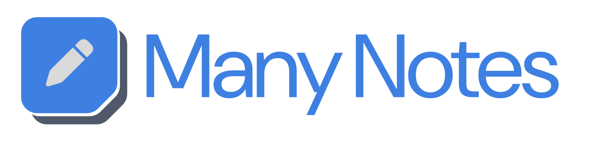

<p align="center">
    
</p>

<p align="center">
    
    
    
    
</p>

Many Notes is a Markdown note-taking web application designed for simplicity! Easily create or import your vaults and organize your thoughts right away.

It uses a database to power its features, but your files are also saved in the filesystem, giving you full control over your vault structure and ensuring easy access and portability.

Vaults are simply storage containers for your files, and Many Notes lets you choose to keep all your files in one vault or organize them into separate vaults.

## Preview


*Light theme*

## Features

- **Multiple users**: Protect your files behind authentication
- **Multiple vaults per user**: Choose how to organize your files
- **OAuth support**: Authenticate using one of the supported providers
- **Collaboration**: Invite other users to access your vaults
- **Broadcasting**: Real-time, live-updating user interfaces
- **File search**: Experience a fast and typo-tolerant search
- **Tree view explorer**: Fast navigation with relevant actions in the context menu
- **Advanced Markdown editor**: Write your Markdown notes faster
- **Automatic saving**: Focus on writing; saving is automatic
- **Templates**: Maintain consistent formatting for your notes
- **Links/backlinks/tags**: Improve note organization by connecting related notes
- **Import/export vaults**: Easily back up and restore your vaults
- **Starter vault**: Helps you get started with Many Notes
- **Light/dark theme**: Automatically selected based on your OS setting
- **Progressive Web App**: Provides a native app-like experience

## Installation

Choose your preferred method to install Many Notes:

- Docker with volumes, for a simpler installation (read below)
- Docker with bind mounts, for easy access to shared paths from the host ([read here](docs/installation/docker-bind-mounts.md))
- Docker with a different database, if you prefer not to use SQLite ([read here](docs/installation/docker-different-database.md))

### Docker with volumes

**Read the [upgrading guide](UPGRADING.md) if you are upgrading from a previous version.**

Create a `compose.yaml` file with:

```yaml
services:
  php:
    image: brufdev/many-notes:latest
    restart: unless-stopped
    environment:
      - APP_URL=http://localhost # address used to access the application
    volumes:
      - database:/var/www/html/database/sqlite
      - logs:/var/www/html/storage/logs
      - private:/var/www/html/storage/app/private
      - typesense:/var/www/html/typesense
    ports:
      - 80:8080

volumes:
  database:
  logs:
  private:
  typesense:
```

Make sure to change the address used to access the application. Feel free to change anything else if you know what you're doing, and read the customization section below before continue. Then run:

```shell
docker compose up -d
```

## Customization

To customize Many Notes, add environment variables to the `compose.yaml` file if using the Docker installation. If you chose the non-Docker installation, you should add the environment variables to the `.env` file instead.

### Custom URL (default: http://localhost)

If you change the default port from 80 or use a reverse proxy with a custom URL, make sure to configure the application URL accordingly. For example, if you change the port to 8080, add:

```yaml
environment:
  - APP_URL=http://localhost:8080
```

### Custom timezone (default: UTC)

Check all available timezones [here](https://www.php.net/manual/en/timezones.php). For example, if you want to set the timezone to Amsterdam, add:

```yaml
environment:
  - APP_TIMEZONE=Europe/Amsterdam
```

### Custom upload size limit (default: 500M)

Increase the upload size limit to allow for the import of larger files. For example, if you want to increase the limit to 1 GB, add:

```yaml
environment:
  - PHP_POST_MAX_SIZE=1G
  - PHP_UPLOAD_MAX_FILE_SIZE=1G
```

### Registration enabled (default: true)

In case you want to disable registration for new users, add:

```yaml
environment:
  - SETTINGS_REGISTRATION_ENABLED=false
```

### Enable OAuth providers

Many Notes supports a convenient way to authenticate with OAuth providers. Typically, these credentials may be retrieved by creating a "developer application" within the dashboard of the service you wish to use. Many Notes currently supports authentication via Facebook, Twitter, LinkedIn, Google, GitHub, GitLab, Bitbucket, Slack, Authelia, Authentik, Keycloak, and Zitadel. You can enable multiple providers simultaneously by adding the corresponding environment variables.

For example, to enable GitHub OAuth, add:

```yaml
environment:
  - GITHUB_CLIENT_ID=CLIENT_ID # change id
  - GITHUB_CLIENT_SECRET=CLIENT_SECRET # change secret
  - GITHUB_REDIRECT_URI=http://localhost/oauth/github/callback # change domain and provider
```

Authelia, Authentik, Keycloak, and Zitadel providers require additional configuration. Read the [OAuth documentation](docs/customization/oauth.md) for more information.

### Custom email service

Configure an email service to send registration and password reset emails by adding:

```yaml
environment:
  - MAIL_MAILER=smtp
  - MAIL_HOST=127.0.0.1
  - MAIL_PORT=2525
  - MAIL_USERNAME=null
  - MAIL_PASSWORD=null
  - MAIL_ENCRYPTION=null
  - MAIL_FROM_ADDRESS=hello@example.com
  - MAIL_FROM_NAME="Many Notes"
```

## Frequently Asked Questions

Read the [FAQs](docs/support/faqs.md) to find the answers to the most common questions.

## License

This project is licensed under the MIT License. See the [LICENSE](LICENSE) file for the full license text.
